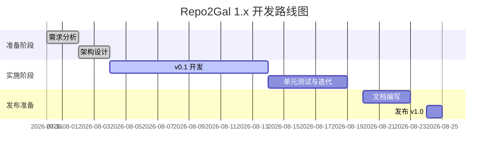

# 执行概要

**Repo2Gal** MVP 的核心目标是：**输入一个 GitHub 仓库地址，输出一个基于 WebGAL 引擎的交互式故事网页**。整个系统保持简洁：使用现成的 WebGAL 前端模板，通过替换生成的 `.wg` 剧本文件实现故事呈现；利用现有的 `repo2txt` 和 `gh2md` 工具完成代码与 Issue/PR 的数据提取，避免重写 GitHub API。文本生成不采用自定义 DSL 或复杂编译流程，而是直接让 LLM 生成 WebGAL 脚本行。生成的故事围绕项目的“数字生命”展开（例如：项目角色化、历史事件化），以带有角色和场景的对话形式呈现。 

如图所示的体系架构与工作流程：  
```mermaid
graph LR
    Input[用户输入 GitHub URL] --> Extract[仓库数据提取]
    Extract --> Context[构建故事上下文 (JSON)]
    Context --> LLM[LLM 生成故事内容]
    LLM --> Script[输出 WebGAL 剧本 (.wg)]
    Script --> Static[生成静态网站]
    Static --> User[用户在网页上体验 Galgame]
```
此架构足够清晰且易于实现，每一步对应一个独立模块：**数据提取** 调用 `repo2txt` 和 `gh2md`；**上下文构造** 将提取结果整理成 JSON；**故事生成** 调用 LLM 接口输出 WebGAL 脚本；**站点构建** 打包 WebGAL 前端与剧本生成网页。系统不做“游戏引擎开发”或交互逻辑创新，仅关注内容生成和部署。

# MVP 范围与非目标

**MVP 范围**（必做）：  
- **输入/输出**：用户提供公开 GitHub 仓库 URL，即可生成一个 HTML 静态页（可托管在 GitHub Pages 等静态站点），里面包含 WebGAL 前端和脚本故事。  
- **故事内容**：基于仓库数据（代码结构、提交历史、Issue/PR、README 等）生成一段剧情。示例内容包括“项目诞生”、“重大事件（如安全漏洞、重构）”等，引入几个代表性角色（模块或功能）和事件。  
- **脚本输出**：直接生成 WebGAL 脚本（.wg 文件），格式例如 `角色:对话;`（见后文）。脚本无需编译，可直接被 WebGAL 前端解析。  
- **代码架构**：采用简单目录结构，清晰划分模块。提供命令行工具（CLI）供开发者使用，如 `repo2gal --repo <url> --out <dir>`。  

**非目标**（不做）：  
- **游戏引擎功能**：不设计自有引擎，不实现即时交互逻辑（如角色移动、解谜游戏等）。所有前端交互依赖 WebGAL 引擎的现成功能。  
- **美术资源**：不制作立绘、音乐等美术资源；剧本以文字为主，可简单嵌入 WebGAL 预设立绘或背景图片。  
- **多语言、部署环境**：先只考虑中文（或仓库 README 所用语言）；不包含复杂的服务器后端，一律静态生成。  
- **AI 数据存储与优化**：不涉及模型训练、缓存用户数据、复杂对话优化等，仅调用第三方 LLM API 即时生成。  

# 系统架构与项目结构

系统架构如上 Mermaid 流程所示，简化为六大步骤：用户输入 → 数据提取 → 上下文构建 → LLM 文本生成 → 剧本输出 → 静态站点。在实现时，可按照以下模块目录组织：  

```plaintext
repo2gal/                  # 项目根目录
│
├─ cli.py                 # 命令行入口，如 parse arguments 并调用主流程
├─ config.yaml            # 配置文件：API 密钥、GitHub 访问令牌等
├─ context_builder.py     # 上下文构建：调用数据提取工具并整理 JSON
├─ narrative.py           # 故事生成：定义 LLM 调用和 prompt 模板
├─ script_generator.py    # 脚本映射：将 LLM 文本转为 .wg 格式（简单映射）
├─ web/                   # 前端静态资源目录（WebGAL 模板）
│   ├─ index.html         # WebGAL 静态页面（引入生成的 story.wg）
│   └─ story_template.wg  # WebGAL 剧本模板（可含占位标记供注入）
└─ output/                # 输出目录（生成的 .wg 脚本和网站）
```

其中：  
- **cli.py**：解析 `--repo`、`--out` 等参数，依次调用后续模块。  
- **context_builder.py**：负责调用 `repo2txt` 和 `gh2md`（作为子进程或库函数），获取仓库文本和 Issue/PR 数据，生成统一的上下文 JSON。  
- **narrative.py**：根据上下文 JSON 调用 LLM（如 OpenAI GPT）生成故事对话文本，使用预设 prompt 模板。  
- **script_generator.py**：将得到的故事文本（角色对话、场景描述）转换为 WebGAL 脚本行（例如“角色:内容;”）。也可直接将 LLM 输出的格式化内容保存为 `.wg`。  
- **web/index.html**：使用 WebGAL 官方提供的示例模板，引入输出的 `story.wg`。  
- **config.yaml**：配置 LLM API Key、GitHub Token、默认分支等（可选）。  

此结构简洁清晰，各部分职责单一。任何程序员阅读后，按照模块功能即可开始实现。

# 数据流与上下文设计

## 输入与数据提取

- **输入**：GitHub 仓库 URL（格式 `https://github.com/owner/repo`）。可选配置：分支、GitHub 访问令牌等。  
- **Repo2txt**：使用现成的 [repo2txt](https://github.com/abinthomasonline/repo2txt) 工具将仓库内容转换为文本。按官方说明，用户提供 URL，选择要包含的文件，然后点击“Generate Output”得到一个 `.txt` 文件。输出可以是一个聚合了代码、README 等文本的单文件。该工具可通过子进程或 API 调用使用（接口未公开，视情况调用命令行）。  
- **Gh2md**：使用 [gh2md](https://github.com/mattduck/gh2md) 导出仓库的 Issue 和 PR 为 Markdown。示例命令：`gh2md owner/repo issues.md` 会导出所有 Issue/PR 到 `issues.md`。同样可在 CLI 中执行此命令（确保环境变量 `GITHUB_ACCESS_TOKEN` 已配置）。输出文件包含标题、正文、评论等信息。  

注意：`repo2txt` 和 `gh2md` 的具体接口未指定，文档中仅需说明调用方式和预期结果。例如：
```
$ repo2txt https://github.com/owner/repo --output repo.txt
$ gh2md owner/repo issues.md
```
以上命令在执行后，`repo.txt` 包含项目代码文本，`issues.md` 包含 Issues/PR。将这些数据读入后，提取必要信息填入上下文。

## 上下文 JSON 架构

将提取的数据整合成一个 JSON 结构传递给 LLM 生成故事。建议包括以下字段（示例）：

```json
{
  "repo": {
    "url": "string",
    "name": "string",
    "description": "string",    // 仓库描述
    "language": "string",       // 主要语言
    "stars": number,
    "forks": number
  },
  "files": [ "string", ... ],   // 关键文件或目录列表
  "contributors": [ "name (贡献者)", ... ],
  "issues": [
    { "id": number, "title": "string", "body": "string" },
    ...
  ],
  "pull_requests": [
    { "id": number, "title": "string", "body": "string" },
    ...
  ],
  "commits": [
    { "sha": "string", "date": "YYYY-MM-DD", "message": "string" },
    ...
  ]
}
```

字段类型说明：  
- `repo`：基础项目信息，如名称、描述、主要编程语言、Star 数、Fork 数等（可通过 GitHub API 获取，或 `repo2txt` 提取的 README）。  
- `files`：项目根目录下的主要文件/文件夹名（如 `src/`、`README.md`、`docs/` 等），可从 `repo2txt` 输出中解析。  
- `contributors`：主要贡献者列表（可以从 Git 历史或 GitHub API 得到，但可选）。  
- `issues`/`pull_requests`：导出的 Issue/PR 简要（主要取标题、正文），用于挖掘故事情节。  
- `commits`：近期或关键提交记录（commit message 用于事件描述）。

此 JSON 将作为 LLM 的上下文输入。具体字段可根据实际数据源进行调整；未明确定义的接口，可在文档中标记为“视实际工具实现而定”。

## LLM 提示模板

故事生成模块使用预定义提示（Prompt），结合上下文 JSON，让 LLM 按 Galgame（视觉小说）形式输出对话脚本。提示模板需包含：项目背景、角色设定提示、故事基调示例等。

**示例 Prompt（中文）**：
```
你是一个 AI 作家，需要根据以下项目上下文撰写一个交互式故事剧情。以西方幻想风格把项目组件人格化成角色，把关键事件情节化。请用 WebGAL 脚本格式输出（“角色名:对话;”），示例：角色A:你好;。
项目名称: {{project.name}}
描述: {{project.description}}
关键文件: {{files}}
主要Issue标题: {{issues[].title}}
主要PR标题: {{pull_requests[].title}}
```
提示模板中用 `{{}}` 表示填入的上下文字段。生成时替换为实际内容。例如：

**示例（few-shot）**：  
```
项目名称: 图形库Alpha
描述: 一个用于绘图的JavaScript库
关键文件: [main.js, utils.js]
主要Issue: ["修复线条渲染错误"]
主要PR: ["添加新颜色支持"]

输出:
勇者:「图形库Alpha，欢迎加入。」
法师:「在远古的代码森林里，图形精灵经历了线条渲染的风暴...」
...
```

可以准备 1-2 个类似示例，引导 LLM 生成格式和风格。具体策略可对比：  

| 提示策略              | 优点                                    | 缺点                                         |
|-----------------------|-----------------------------------------|----------------------------------------------|
| **直接叙事式**        | 简单直接，结合上下文JSON后立刻生成脚本   | LLM 可能输出冗长或偏离主题，需要后处理       |
| **分步提取式**        | 先让 LLM 列角色和事件，再生成脚本         | 步骤多，增加交互；提示连贯性需控制好          |
| **Few-shot 示例式**   | 引导明确输出格式，保证脚本符合要求       | 需要准备高质量示例，示例太多可能冲击上下文长度 |
| **风格限定式**        | 明确指定“Galgame 风格”，“西方奇幻”等   | 生成结果依赖 LLM 理解，有时仍需人工微调        |

可根据具体 LLM 性能和需求在以上策略间权衡。对于 MVP，可先使用简单的**直接式**提示结合示例。

## WebGAL 脚本格式

生成的故事需要符合 WebGAL 脚本语法。简而言之，角色对话格式是 **“角色:文本;”**（英文冒号和分号）。例如：

```
雪之下雪乃:请用茶;
由比滨:啊，谢谢;
```

对话行以分号结束，可连续多行；连续对话可省略角色名（用`;`延续当前角色）。旁白对话可留空角色名（例如 `:一声巨响在城市上空回荡;`）。我们不需要实现复杂命令，仅需生成对话和少量场景切换命令。最终 `.wg` 文件可只包含对话（和可选的 `changeBg`、`changeFigure` 等命令）。

**映射规则**（示例）：
- JSON 中某条记录表示角色对话时，写成 `角色:对白;`。  
- 如需切换场景或背景，可在故事逻辑中插入 `changeBg:图片名称;`。  
- 结束脚本时加入 `end;`。  

以上格式与 [WebGAL 官方文档](https://docs.openwebgal.com/webgal-script/dialogue.html) 示例一致。

## 模块集成

- **repo2txt 接入**：在 `context_builder.py` 中调用，例如使用 `subprocess.run(["repo2txt", repo_url, "--output", "repo.txt"])`，然后读取 `repo.txt`。输出即是聚合的文本内容，无固定结构。（未指定接口，故文档注明“调用命令行工具”）。  
- **gh2md 接入**：调用 `subprocess.run(["gh2md", owner+"/"+repo, "issues.md"])`。生成的 `issues.md` 文件包含所有 Issue/PR，可进一步解析为 JSON。（若工具支持参数，可指定只导出 Issue 或 PR）。  
- **LLM 接口**：在 `narrative.py` 中使用 OpenAI 或其它 LLM API，将上下文 JSON 和提示一起发送。需在 `config.yaml` 中配置 API Key。示例：调用 `openai.ChatCompletion.create()`，参数包含系统指令（可选）、上述 Prompt 和上下文字段。

对于以上调用，假设系统已安装并可通过命令行调用相应工具；若不指定，文档中应注明“可根据环境替换为等效 API”或类似备注。

# 构建/运行步骤

1. **环境准备**：确保已安装 Python 3.x（或 Node.js/Pip 等，视项目语言而定）。安装依赖库（如 `openai`、`pyyaml` 等）。可提供 `requirements.txt` 或 `package.json`。  
2. **配置**：在 `config.yaml` 填写必要密钥：  
   - `github_token`: GitHub 访问令牌（可选，仅当访问频率受限或私人仓库时）。  
   - `openai_api_key`: LLM 服务密钥（如 OpenAI Key）。  
3. **运行命令**：通过 CLI 运行，如：  
   ```
   python cli.py --repo https://github.com/owner/repo --out output_dir
   ```  
   或自定义类似命令。执行后将在 `output_dir` 下生成：  
   - `story.wg`：LLM 生成并格式化的 WebGAL 剧本。  
   - `index.html`：预置的 WebGAL 页面，引入 `story.wg`。  
   - 资源文件夹（若有背景图、立绘等）。  
4. **部署打包**：输出目录 `output_dir` 可直接部署为静态站点。例如将其内容推送到 GitHub Pages、Netlify 等托管，用户访问 `index.html` 即可体验。  

**示例**：构建完成后，打开生成的网页，WebGAL 引擎会自动运行 `story.wg`，呈现视觉小说式的交互剧情。

# 测试清单与验收

- **仓库数据提取**：给定一个公开仓库，执行 `repo2txt` 后检查 `repo.txt` 内容是否包含 README、代码摘要等；执行 `gh2md` 后检查 `issues.md` 中是否含有所有 Issue 标题/评论。  
- **上下文 JSON 构造**：验证 `context_builder.py` 输出的 JSON 是否包含预期字段（项目名、描述、文件列表、部分 Issue 标题等）。可对比工具输出示例文件。  
- **LLM 调用**：通过单元测试或手动测试，检查 `narrative.py` 能正常调用 API，得到合理格式的输出文本。  
- **WebGAL 剧本格式**：校验 `story.wg` 是否符合 WebGAL 语法（角色名后有英文冒号和分号，使用英文标点等）。可用正则检查每行格式或加载 WebGAL 编辑器测试。  
- **静态站点效果**：将输出部署到本地或服务器，打开页面后能看到故事对话。检查场景切换、对话连续性正常。  
- **边界情况**：测试无 Issue、无 PR 或无贡献者时程序健壮性；测试不同仓库大小（大项目 vs 小样例）是否能顺利生成结果。  
- **用户验收**：最终验收标准为：给定一个示例仓库，生成的故事页面至少包含 3 个角色对话场景，涵盖首次提交事件及一个项目特殊事件，能够完整运行 WebGAL 引擎且无语法错误。  

# 简易 UX 示例

下面以一个假想示例展示网页用户流程：  

**1. 用户界面**：静态网页仅包含一个按钮或输入框，让用户输入 GitHub 仓库地址（或者直接在代码里固定示例仓库）。本示例直接跳转至生成的故事页。  

*图1：示例代码界面/对话框截图（图像来自[示例资源]，仅作示意）。*  
如图所示（示意），用户看到引入了 WebGAL 引擎的网页；故事对话以对话框形式呈现，角色头像在旁（可使用 WebGAL 预设人物立绘）。下图 [35] [37] 示意故事可能采用的风格：  

*图2：西方奇幻风格示例（虚构场景）。*  
*图3：科技机械主题示例（虚构场景）。*  

**2. 故事样例**（节选）：  
```
旁白:「很久很久以前，一个名为的代码城邦诞生了;」
守护者:「我是守护这座城市的路由服装，任何访问都需要通过我的关卡;」
黑暗法师:「一次致命漏洞如魔龙袭来，数据流失陷入混乱;」
守护者:「勇士，请帮助我修复漏洞，我们的未来才有希望;」
选择: "帮助修复漏洞" -> [标签: patch_success]
```
用户可点击“帮助修复漏洞”等选项（WebGAL 的 `choose` 命令），进入后续剧情分支。  

**3. 页面流程**：用户访问页面后，WebGAL 引擎自动执行 `story.wg`。Web 界面可显示标题页、对话框和选项，呈现类 Galgame 的交互。脚本生成流程见图解，确保从仓库到页面的可视化内容一致。  

# v1.x 插件与扩展路线

MVP 实现后，后续可开发插件增强功能，例如：  

- **依赖分析插件**：解析代码依赖关系图，将模块抽象为角色，丰富角色关系。  
- **交互式教程插件**：生成“阅读模式”，在故事中加入注释提示，引导开发者学习源码。  
- **更多故事风格模板**：如科幻、校园等不同世界观；用户可选择模板风格。  
- **外部数据插件**：接入 GitHub star 趋势、社区讨论，将动态事件加入剧情（如社区热议触发剧情）。  
- **多语言支持插件**：自动检测仓库语言并生成对应语言故事。  
- **图片/立绘注入插件**：根据脚本关键字插入背景图或人物图像，提高视觉效果。  

这些插件沿用核心流水线，只在上下文构造或脚本生成阶段加入新功能，无需改动底层架构，可逐步规划。



# 参考资料

- WebGAL 引擎官方文档和示例  
- `repo2txt` 项目文档  
- `gh2md` 使用说明  

以上资源提供了工具用法、脚本格式等信息。文中引用自这些资料的主要信息已标注。文档未覆盖的接口细节将根据实现时工具实际行为填写。