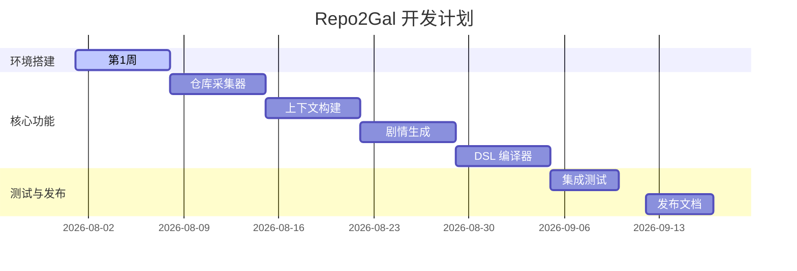

# 执行摘要

Repo2Gal 的 MVP 目标是将任意一个 GitHub 仓库自动转换为**交互式动漫风格的项目文档**（基于 WebGAL 引擎），而**不是**直接生成完整的 Galgame。MVP 输入为仓库的 GitHub URL，输出为一个 WebGAL 游戏包（包含剧情、角色定义等），用户可在浏览器中体验。该流程涉及**仓库采集器**、**上下文构建器**、**剧情生成器**、**DSL 编译器**、**WebGAL 渲染**五大核心模块，各模块职责明确且可分步实现。整个架构简单清晰，任何开发者阅读后即可着手编码。下面文档详细定义了项目范围、模块职责、接口和数据模型，并给出示例流程、开发计划、测试要求及部署说明。

**MVP 范围概述：**  
- **输入**：GitHub 仓库地址 (owner/repo 或完整 URL)。  
- **输出**：使用 WebGAL 脚本生成的故事包（包括 JSON 格式的故事稿、WebGAL `.wg` 脚本及可选的资源文件）。  
- **不做项**：自定义立绘/UI设计、BG音乐创作、复杂分支剧情。MVP 只生成**线性剧情**脚本，并以 WebGAL 演示为主。  

本计划兼顾技术可行性与项目创意，选用了 v4 架构中「上下文构建 + DSL 编译」的设计思路，并融合了 v5 文档中对开发流程和工程规范的建议。项目核心在于“让代码仓库拥有灵魂”，最终让开发者通过玩故事化文档了解源码。

## MVP 输入/输出与不做项

- **输入**：GitHub 仓库 URL，例如 `https://github.com/vuejs/core`。  
- **输出**：WebGAL 故事包（含剧情脚本、角色定义等）。  
- **不做**：素材创作（立绘、音效）、复杂分支逻辑、本地化/翻译、多语言支持等。  
- **MVP 目标**：实现从“仓库数据”→“项目上下文 JSON”→“Galgame 剧本 DSL”→“WebGAL 运行时”的完整链路，使开发者可通过 `repo2gal` CLI 生成并打开一个简单可交互的项目故事页面。

## 架构概览

MVP 总体架构分为五个阶段，依次是：**仓库采集**、**上下文理解**、**剧情生成**、**DSL 编译**、**WebGAL 渲染**。如下图所示，数据流自上而下、依赖关系清晰：

```mermaid
flowchart LR
    A[GitHub Repo URL] --> B[仓库采集器<br/>(Repository Collector)]
    B --> C[上下文构建器<br/>(Context Builder)]
    C --> D[剧情生成器<br/>(Story Generator)]
    D --> E[DSL 编译器<br/>(DSL Compiler)]
    E --> F[WebGAL 渲染器<br/>(WebGAL Renderer)]
```

- **仓库采集器**：克隆仓库并提取必要数据（文件结构、提交历史、Issue/PR 等）。  
- **上下文构建器**：分析仓库数据、生成结构化的 Context JSON，包括项目元信息、主要角色、事件等。  
- **剧情生成器**：调用 LLM 生成剧情 DSL（包含场景、对白、角色设定等）。  
- **DSL 编译器**：将剧情 DSL 转换为 WebGAL 可执行的脚本格式。  
- **WebGAL 渲染器**：将生成的 WebGAL 脚本加载到引擎，输出 HTML/可浏览的游戏页面。

> *图：Repo2Gal MVP 架构流程图（从仓库 URL 到 WebGAL 输出）*

## 核心模块与职责

### 仓库采集器 (Repository Collector)
- **职责**：接收 GitHub URL，克隆仓库到本地；使用 GitHub API 拉取重要元数据（如仓库描述、语言、Star 数）；收集提交历史、Issue 和 PR 评论文本。  
- **接口示例**：  
  ```python
  def clone_repo(owner: str, repo: str, dest: str) -> None
  def fetch_repo_metadata(owner: str, repo: str) -> dict  # 调用 GitHub API
  def fetch_issues_and_prs(owner: str, repo: str) -> List[dict]
  def fetch_commits(owner: str, repo: str) -> List[dict]
  ```
- **数据输出**：本地仓库目录 + 收集到的 JSON 数据（可存储在 SQLite 或 JSON 文件）。  

### 上下文构建器 (Context Builder)
- **职责**：解析采集器输出的数据，构建“仓库情报图谱”：分析文件依赖、频繁变动文件、贡献者活动等，提炼出故事元素（角色、地点、事件）。  
- **具体功能**：  
  - 读取 `package.json` 或项目配置确定技术栈；  
  - 统计各文件或组件的修改频率和贡献者，识别“关键角色”；  
  - 提取重要提交消息或 Issue 标题作为**剧情节点**；  
  - 输出统一的 Context JSON 格式，用于下游生成。  
- **数据模型**：以 Pydantic 定义 Context 结构。例如：  

  ```python
  from pydantic import BaseModel
  from typing import List, Optional

  class Event(BaseModel):
      id: str
      type: str         # e.g. "commit", "issue", "refactor"
      title: str
      detail: str
      author: str
      date: str

  class Character(BaseModel):
      name: str
      role: str        # e.g. "守门人", "探索者"
      stats: dict      # 自定义属性
      history: List[str]

  class ProjectContext(BaseModel):
      repo_name: str
      description: str
      language: str
      contributors: List[str]
      characters: List[Character]
      events: List[Event]
      # ...其他字段
  ```

- **示例输出 (JSON)**：  

  ```json
  {
    "repo_name": "DemoProject",
    "description": "A sample project",
    "language": "Python",
    "contributors": ["alice", "bob"],
    "characters": [
      {"name": "AuthService", "role": "守门人", "stats": {"importance": 95}, "history": ["修复登录漏洞"]},
      {"name": "UI组件", "role": "神秘访客", "stats": {"reliability": 80}, "history": ["第一次提交"]}
    ],
    "events": [
      {"id": "c1", "type": "commit", "title": "修复内存泄漏", "detail": "...", "author": "alice", "date": "2026-07-30"},
      {"id": "i42", "type": "issue", "title": "404 Not Found 错误", "detail": "...", "author": "bob", "date": "2026-07-20"}
    ]
  }
  ```

### 剧情生成器 (Story Generator)
- **职责**：对 `ProjectContext` 调用 LLM，生成游戏剧情脚本（符合 DSL 语法）。使用专门设计的提示词和函数调用（function calling）机制，引导模型输出结构化对话和事件描述。  
- **使用技术**：OpenAI ChatCompletion API，可利用「Function Calling」特性让模型输出符合 JSON schema 的剧情段落。  
- **接口示例**：  
  ```python
  def generate_story(context: ProjectContext) -> str:
      """
      调用 LLM 生成剧情 DSL 文本。
      """
  ```
- **数据示例 (DSL 片段)**：  

  ```markdown
  scene "CastleHall" with bgm "theme.mp3"
  character "AuthService" as Gatekeeper
  character "UI组件" as Visitor
  dialog "Gatekeeper": "欢迎来到系统大厅，一切皆有序..."
  dialog "Visitor": "这里发生过一次丢失数据的神秘事件..."
  ```
  这段 DSL 定义了场景、角色和对话，能被下游编译成 WebGAL 脚本。

### DSL 编译器 (DSL Compiler)
- **职责**：将生成的剧情 DSL 转换为 WebGAL 引擎可执行的脚本格式。包括：解析自定义 DSL 语法，生成 WebGAL 命令（如 `say`、`changeBg` 等）。同时处理分支选择（MVP 可先忽略复杂分支，仅线性叙事）。  
- **接口示例**：  
  ```python
  def compile_to_webgal(dsl_text: str, output_dir: str) -> None:
      """
      解析 DSL 并输出 WebGAL 项目文件到 output_dir。
      """
  ```
- **示例转换**：DSL 中的 `dialog "Gatekeeper": "..."` 转换为 WebGAL 的 `say` 命令；`scene "CastleHall"` 转为 WebGAL 场景切换命令。

### WebGAL 渲染器 (WebGAL Renderer)
- **职责**：调用 WebGAL CLI 或使用 Python 的系统调用，编译并运行生成的 WebGAL 项目。此阶段可以本地启动 WebGAL 服务器供预览，也可以生成静态发布包。  
- **接口示例**：  
  ```bash
  webgal build <project_dir>   # 构建 WebGAL 游戏
  webgal serve <project_dir>   # 本地调试运行
  ```
- **注意事项**：WebGAL 要求 Node 环境，可使用 CLI 工具，也可直接使用 WebGAL 提供的编译 API。MVP 可简化为输出已生成的 `.wg` 文件，用户自行使用 WebGAL 编辑器或脚本打开。  

## 数据模型示例

如上所述，**Context JSON** 是核心数据结构，建议使用 Pydantic 定义其 Schema。下面给出部分示例：  

```python
from pydantic import BaseModel
from typing import List

class Context(BaseModel):
    repo_name: str
    description: str
    language: str
    contributors: List[str]
    characters: List[Character]
    events: List[Event]
```

此模型即为输入给 `generate_story()` 的结构化数据。LLM 输出的 DSL 可视为**自定义脚本**，需要 DSL 编译器解析。示例 DSL 语法片段见上节。编译后可导出为 YAML/JSON 配置文件（如场景定义、角色列表）和 WebGAL 脚本。

## 最小可运行示例流程

以下示例演示了 MVP 从输入到输出的完整链路。假设目标仓库为 `https://github.com/example/demo`：  

```bash
# 1. 克隆并收集数据
repo2gal --repo https://github.com/example/demo --output ./output
# 执行后，程序克隆仓库并提取 Context JSON，保存到 output/context.json

# 2. 调用 LLM 生成剧情 DSL
#    （内置在命令中自动完成）
```

输出目录结构示例：  
```
output/
│
├── context.json        # 上下文数据（JSON）
├── story.wg           # 生成的 WebGAL 剧情脚本
└── webgal_project/     # WebGAL 项目文件（可选）
    ├── script/
    │   └── main.gal   # WebGAL 转换后的脚本文件
    └── assets/ ...
```

然后用户可以通过 WebGAL CLI 进行运行：  
```bash
cd output/webgal_project
webgal serve
```
即可在浏览器中看到生成的故事页面。

> *图：示例执行流程图（用户输入 GitHub URL→程序生成 WebGAL 游戏包）*

## 开发任务清单与优先级

项目采用迭代开发，每周一个小里程碑：

- **第1周**：项目环境搭建，完成核心依赖配置（Python 3.11、OpenAI API、GitHub API）。搭建基本 CLI 框架。  
- **第2周**：实现仓库采集器：支持克隆仓库、调用 GitHub API 拉取 commit/issue 数据。输出 Context JSON 初步结构。  
- **第3周**：实现上下文构建器：解析仓库结构，生成初版 `ProjectContext` 对象；定义并生成基本角色和事件列表。  
- **第4周**：集成 LLM 调用（使用 OpenAI ChatCompletion 或 GPT）：设计提示词和 JSON schema，能输出简单对话和角色描述。生成最基础剧情 DSL。  
- **第5周**：编写 DSL 编译器：解析 DSL 示例，将其转换为 WebGAL `.gal` 脚本文件。测试输出是否能被 WebGAL 编辑器加载。  
- **第6周**：完善工程化规范（参照 v5 文档建议），添加配置文件 Schema、错误处理、日志记录等。准备测试用例。  
- **第7周**：集成测试与调整：使用真实开源仓库（如 vuejs/vue）进行测试，确保各模块协同工作；修复逻辑和性能问题。  
- **第8周**：发布准备：编写 README、CONTRIBUTING，整理示例，打包 Docker 镜像或发布到 PyPI。  



- **测试要点**：  
  1. 仓库采集器是否正确获取所有必要数据（如 commit 列表、Issue 评论）。  
  2. Context JSON 的结构是否符合 Pydantic Schema，字段完整无误。  
  3. LLM 输出是否满足 DSL 语法要求：可编译、逻辑连贯。  
  4. DSL 编译后能否成功使用 WebGAL 编译并运行（无语法报错）。  
  5. 性能与边界：对大仓库/历史长仓库的处理时间是否在可接受范围内。  

- **验收标准**：  
  - 输入任意公开 GitHub 仓库 URL，最终可生成至少一章简短剧情并在 WebGAL 中正常播放。  
  - 任意步骤出错时，应给出清晰日志或错误提示；项目运行依赖文档齐全。  
  - 代码风格符合 PEP8（Python）和项目约定；README、CONTRIBUTING 等文档齐全。

## 部署与运行说明

- **本地环境**：Python 3.11+。建议使用虚拟环境 (`venv`)。  
- **依赖库**：  
  - `openai`（LLM 接口）  
  - `PyGithub`（GitHub API 调用）  
  - `pydantic`（数据验证）  
  - `requests` 或 `httpx`（可选，用于额外网络请求）  
  - 可能的数据库：SQLite（使用内置 `sqlite3` 管理序列化存储）。  
- **环境变量**：  
  - `OPENAI_API_KEY`：OpenAI 访问密钥。  
  - `GITHUB_TOKEN`（可选）：GitHub 访问令牌，用于更高请求限制。  
- **CLI 运行**：示例命令见下文 **CLI 使用示例**。  
- **Docker**：可提供示例 `Dockerfile`：  

  ```dockerfile
  FROM python:3.11-slim
  WORKDIR /app
  COPY . /app
  RUN pip install --no-cache-dir -r requirements.txt
  ENV OPENAI_API_KEY=<your_key>
  ENV GITHUB_TOKEN=<token>
  ENTRYPOINT ["python", "-m", "repo2gal"]
  ```

- **CI/CD**：建议使用 GitHub Actions。可设定如下流程：  
  1. **Lint/格式检查**：使用 `flake8`、`black`。  
  2. **单元测试**：对各模块（例如仓库采集器）编写 pytest。  
  3. **集成测试**：运行 CLI 示例，检查最终输出。  
  4. **发布**：成功后自动发布 PyPI 包或构建 Docker 镜像并推送容器仓库。  

## 扩展插件接口与未来功能

MVP 设计时保留插件扩展能力，后续可添加：  
- **插件接口**：采用约定的插件目录（如 `plugins/`），每个插件负责扩展一种数据源或处理逻辑。例如 `plugins/github_history` 可监听 Git 历史并生成剧情，`plugins/gh2md` 解析评论生成对话。主程序在采集阶段动态加载插件，插件通过统一接口返回结构化事件/角色。  
- **未来可选功能**：  
  - **多分支剧情**：允许在剧情 DSL 中定义选择分支。  
  - **实时交互**：与用户实时对话（类似文字冒险），而非静态文档。  
  - **立绘/UI**：集成简单的美术资源，让故事更具吸引力。  
  - **其他 LLM 模型**：支持自托管模型或本地化模型。  
  - **语言支持**：后续可加入多语言接口（翻译仓库说明或角色对话）。  

## v1–v8 版本比较

下表总结了之前 v1.1–v8 文档版本的关键优缺点，并说明为何最终选用 v4 和 v5 的设计思路：

| 版本    | 优点                                                         | 缺点                                                         |
|-------|------------------------------------------------------------|------------------------------------------------------------|
| v1.1  | 思想新颖，「仓库有灵魂」首次明确；提出 WebGAL 黑盒原则；资源解耦设计。    | 设计较早，仅包含基本设想；缺少上下文构建层；过度依赖 LLM，未深入架构。 |
| v2    | 类似商业 PRD，规范详细（CLI、错误码、Context JSON、Schema）；强调编译器职责。 | 过于细致和复杂，像企业级产品说明，MVP 不需要所有功能；实现难度大。    |
| v3    | 富有创意和叙事感，三模式划分明确；三种体验模式（Overview/Onboarding/History）构想吸引人。 | 架构仍信赖 LLM 直接读全部代码；缺少中间的上下文分析层；方案实现风险高。  |
| **v4**  | （推荐）将项目定位为交互式动漫文档，明确了 **Context Builder** 层和 DSL 编译；架构清晰合理。 | 初版缺少详细工程约束说明，需要补充开发规范。                          |
| **v5**  | （推荐）补充了开发原则和规范（如无需复杂工具调用、MVP 简化要求）；强化了开发纪律。          | 偏向规范和流程指导，不含新架构内容；需与 v4 架构结合使用。               |
| v6    | 宣传风格强，语言鼓舞人心；概述了项目特点和愿景。                          | 太像白皮书宣传，不适合作为技术文档；目标过于宏大，易使项目范围膨胀。     |
| v7    | 增加了部分技术调研和示例（Issue/PR 转对话等）；侧重底层细节和实现可能。        | 属于附加调研，非核心架构；未整合入主方案。                            |
| v8    | 关注依赖选型和现有技术（如 WebGAL、Graph Tooling）；指出多模态问题。           | 也非核心，更多是补充材料；需要放到扩展功能中。                          |

**选用理由**：综合考虑 **实现可行性** 和 **项目生命力**，我们采纳了 v4 的整体架构（加入 Context Builder，并以 “交互式文档” 而非纯游戏为目标）以及 v5 的工程规范建议。这样既保留了创意，又保证了 MVP 不至于功能过载，能快速迭代。

## 示例文件与命令

#### README.md（草案）
```markdown
# Repo2Gal

Repo2Gal 是一个将 GitHub 代码仓库转化为互动动漫文档的工具（基于 WebGAL 引擎）。输入仓库 URL，输出可以在浏览器中体验的剧情脚本。

## 功能
- 从 GitHub 克隆仓库并提取关键信息
- 使用 OpenAI GPT 生成角色和剧情
- 将剧情转换为 WebGAL 脚本进行渲染

## 安装
```bash
pip install repo2gal
```

## 使用示例
```bash
repo2gal --repo https://github.com/example/demo --output ./demo_story
```
运行后，在 `./demo_story` 目录中生成故事脚本和 WebGAL 项目。

## 支持
- WebGAL 文档：[https://docs.openwebgal.com](https://docs.openwebgal.com)
- GitHub API 文档：[List commits](https://docs.github.com/en/rest/commits/commits)

## 许可
本项目使用 MPL-2.0 开源协议，详见 LICENSE 文件。
```

#### CONTRIBUTING.md（草案）
```markdown
# 参与贡献

感谢您对 Repo2Gal 的关注！欢迎贡献代码、提交 issue 或改进文档。

## 开发环境
- Python 3.11
- 安装依赖：`pip install -r requirements.txt`
- 设置环境变量：
  - `OPENAI_API_KEY`：OpenAI API 密钥
  - `GITHUB_TOKEN`：可选的 GitHub 访问令牌

## 分支策略
- `main` 分支存放稳定版本。
- 每项新功能或修复建议使用 `feature/xxx` 分支，并提交 PR。

## 提交规范
- 代码格式使用 Black（PEP8）。
- 按模块编写单元测试，并确保测试通过。

## 许可
提交内容需遵守 MPL-2.0 许可协议。
```

#### CLI 使用示例
```bash
# 使用 repo2gal CLI 生成故事
$ repo2gal --repo https://github.com/example/demo --output ./story_output
克隆仓库 https://github.com/example/demo 到本地...
提取提交历史 (共 120 条) 和 Issues...
生成上下文 JSON: story_output/context.json
调用 LLM 生成剧情脚本...
编译为 WebGAL 项目: story_output/webgal/
完成！运行 'webgal serve story_output/webgal' 以启动体验。
```

上述示例演示了基本的执行流程，输出内容为故事上下文和可运行的 WebGAL 项目。任何程序员参照此技术设计文档都能开始实现 Repo2Gal MVP，逐步完善并最终发布一个可以分享给开发者的互动文档工具包。